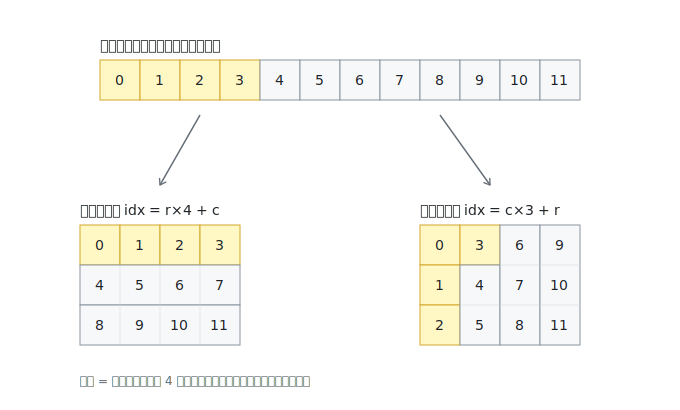

# 行主序与列主序：读懂 GEMM 代码的内存布局基础

> 这是阅读本仓库所有 kernel 的预备知识。核心一句话：**内存永远是一维的，"行主序/列主序"不是数据的属性，而是一条把二维坐标翻译成一维下标的公式。**

## 1. 布局 = 公式

- 行主序（row-major）：`idx = r * ld + c`（同一行的元素在内存里连续）
- 列主序（col-major）：`idx = c * ld + r`（同一列的元素在内存里连续）

`ld` 是 leading dimension：行主序下是"一行的跨度"，列主序下是"一列的跨度"。

同一段 12 个元素的内存，两种公式解读出两个不同的矩阵：



## 2. kernel 的"布局"写死在下标公式里

kernel 收到的参数只有裸指针（如 `half *B`），没有任何布局信息。布局体现在代码怎么算下标。由此得到一个读代码的万能技巧——**看下标公式反推布局**：

```cpp
A[m * K + k]   // 行号 m 乘跨度 → 行主序，ld = K
B[n * K + k]   // 列号 n 乘跨度 → 列主序，ld = K
C[m * N + n]   // 行号 m 乘跨度 → 行主序，ld = N
```

WMMA API 里的 `wmma::row_major` / `wmma::col_major` 模板参数做的是同一件事：告诉硬件用哪条公式解读你给的指针。

## 3. 换公式 = 免费转置

同一块内存，行主序读出来是 X，列主序读出来就是 Xᵀ。所以"B 是列主序的 K×N"和"B 是行主序的 N×K"是同一块内存的两种说法。cuBLAS 接口里的 `CUBLAS_OP_T` 玩的就是这个：不动数据，只换解读公式。

## 4. 为什么 A 行主序、B 列主序混用，结果还是对的

矩阵乘法"一行乘一列"，直觉上 A 和 B 似乎必须遵循同一套存储顺序——这是把**数学运算**和**内存存储**粘在一起了，它们其实是解耦的两层。

数学发生在"逻辑矩阵"层面：

```
C(m,n) = Σₖ A(m,k) × B(k,n)
```

这条公式只关心**元素的值**，不关心值放在内存哪个位置。存储顺序只是"每个元素放在哪个抽屉"，kernel 的职责是用与存放方式**配套**的取址公式把正确的值取出来。

用 2×2 的例子钉死这件事。设逻辑矩阵 B = `[[1,2],[3,4]]`（即 B(0,1)=2）：

- 按**行主序**存：内存是 `[1, 2, 3, 4]`，取 B(k,n) 用 `idx = k*2 + n` → B(0,1) = mem[1] = **2** ✓
- 按**列主序**存：内存是 `[1, 3, 2, 4]`，取 B(k,n) 用 `idx = n*2 + k` → B(0,1) = mem[2] = **2** ✓

两种存法内存内容完全不同，但公式配对后**取出的值一样**，后面的乘加运算自然一样。"A 行主序、B 列主序"没有任何矛盾：kernel 对 A 用行主序公式取数、对 B 用列主序公式取数，各取各的，取到的都是正确的逻辑元素值。

"一行乘一列"里的行和列是**逻辑概念**：A 的第 m 行指 A(m,0..K-1) 这 K 个值，它们在内存里横着放、竖着放都无所谓，只要公式能找到。

## 5. 本仓库的布局约定

[Matrix 类](../src/common/matrix.h)初始化时只是往一维连续内存里填随机数，没有布局概念。**约定由基准 cuBLAS 调用定下**（[tester.h](../src/common/tester.h)）：

```cpp
cublasGemmEx(handle, CUBLAS_OP_T, CUBLAS_OP_N, N, M, K, &alpha,
             B, CUDA_R_16F, K,    // B 的 leading dim 是 K → 列主序 K×N
             A, CUDA_R_16F, K,    // A 的 leading dim 是 K → 行主序 M×K
             &beta, C, CUDA_R_16F, N, ...);
```

所有 kernel 与 cuBLAS 用同一套解读公式，面对同一个逻辑矩阵，正确性校验才能对上。

由于 B 是随机数填出来的，"它本来是什么布局"这个问题不存在——**解读公式本身定义了逻辑矩阵是什么**。但如果你把真实业务里行主序存储的 B 直接塞给这些 kernel，它会按列主序公式取数，实际算出 A×Bᵀ：kernel 没有错，是调用方违反了布局契约。这就是 BLAS 接口必须显式声明 op（N/T）和 leading dimension 的原因。

## 6. 为什么故意选这个组合（TN 布局）

关键在累加方向 K。GEMM 内层循环沿 K 推进：A 取一行（横着走 K 个），B 取一列（竖着走 K 个）。

- A 行主序 → 沿 K 走一行，内存连续
- B 列主序 → 沿 K 走一列，内存连续

两边加载都顺着连续内存走，warp 的 32 个线程访问相邻地址，满足合并访存（coalescing）；MMA 路径的 `ldmatrix` 指令也正好吃这种"沿 K 连续"的布局。反过来，若 B 用行主序，沿 K 每读一个元素都要跨 N 个元素跳跃，带宽利用率大幅下降。

**布局的选择只影响性能，不影响正确性**——这是本文所有内容的最终总结。

## 检查点

1. `C + warp_row * N + warp_col` 这个地址（见 [wmma_naive.cu](../src/wmma/wmma_naive.cu)），用第 2 节的技巧反推：C 是什么布局、ld 是多少？
2. 一块内存按行主序解读是 3×4 矩阵 X，按列主序解读得到的矩阵和 X 是什么关系？
3. 如果把本仓库 kernel 的 B 换成行主序输入（不改 kernel），算出来的结果等价于什么表达式？
