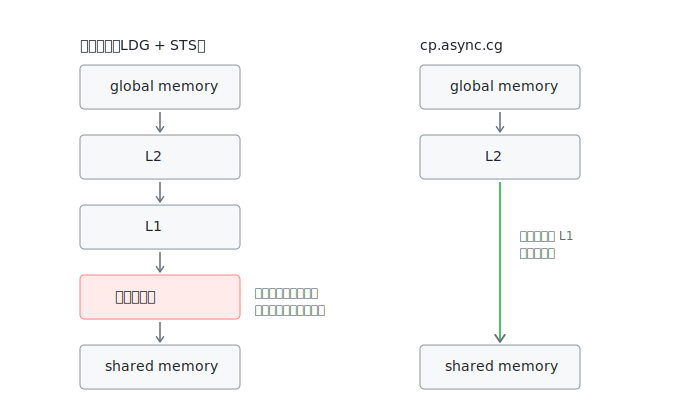

# wmma_async 解读：cp.async 买的不是速度，是入场券

> 对应源码：[src/wmma/wmma_async.cu](../src/wmma/wmma_async.cu)。前置阅读：[wmma_padding 解读](wmma_padding.md)。

先挂一个反直觉的实测（RTX 5060，M=512 N=2048 K=1024）：

```
Wmma-Padding: 24.1 TFLOPS
Wmma-Async:   23.3 TFLOPS   ← 用了更先进的指令，反而慢了一点
```

**为什么不快反慢？因为这一课买的不是速度，是入场券。**

## 唯一的改动：换了搬运指令

和 padding 版逐行 diff，分块、padding、计算、写回全部原样，唯一变化是阶段 1 的拷贝。原来的同步写法：

```cpp
*((int4 *)&smem[A_smem_idx][0] + ...) = *A_lane_ptr;          // padding 版
```

换成（第 105-108 行）：

```cpp
uint32_t A_smem_lane_addr = __cvta_generic_to_shared(&smem[A_smem_idx][0]) + ...;
CP_ASYNC_CG(A_smem_lane_addr, A_lane_ptr, 16);                // async 版
```

以及发射完所有拷贝后（第 130-133 行）：

```cpp
CP_ASYNC_COMMIT_GROUP();   // 把刚才发射的所有 cp.async 打包成一组
CP_ASYNC_WAIT_GROUP(0);    // 等到"在途组数 ≤ 0"，即全部到货
__syncthreads();
```

`CP_ASYNC_CG` 宏展开是一条 PTX 指令 `cp.async.cg.shared.global`（见 [ptx.h](../src/common/ptx.h)）。这条指令改变的是数据的走法：



## 三个新面孔

### 1. cp.async.cg.shared.global

"从 global 拷到 shared，异步执行"。两个关键性质：

- **异步**：线程发射后**不等数据到达**就继续跑下一条指令，拷贝由硬件在后台完成。同步写法里线程要干等 global memory 几百个周期的延迟，现在这个等待被剥离出去了。
- **`.cg` 后缀**（cache global）：数据走 L2 直达 smem，不经过 L1、不经过寄存器。省下的不只是路程：同步写法每线程要占寄存器当中转、发两条指令（LDG 读 + STS 写）；cp.async 一条指令、零寄存器占用。`.ca` 变体会在 L1 留一份（这里用不上——数据进了 smem 就不会再从 L1 读）。

### 2. __cvta_generic_to_shared

地址翻译。cp.async 的目的操作数要求 shared memory 地址空间的 32 位地址，C++ 指针是 64 位通用地址，这个内建函数做转换。样板代码，见到不用慌。

### 3. commit_group / wait_group N

**异步操作的账本机制**，整个体系里最重要的概念：

- 每条 cp.async 发射后进入"在途"状态
- `commit_group`：把此前发射的所有在途拷贝打包封口成一组
- `wait_group N`：阻塞，直到在途的组数 ≤ N

注意 N 可以不是 0：`wait_group 1` 意思是"最老那组必须到货，最新一组还在路上没关系"——**这就是流水线的控制原语**。

## 为什么这一课不提速

看第 130-131 行的用法：发射完立刻 `wait_group(0)`——发射之后原地等到全部到货才开算。时间线上搬运和计算依然严格串行，和 padding 版一模一样；省掉的寄存器中转收益恰好被别的开销抵消，所以实测持平甚至略慢。

它买到的是：**拷贝从"阻塞动作"变成了"可延迟结账的后台任务"**。同步拷贝没有"发射"和"完成"的分离，你无法不等它；cp.async 把这两个时刻拆开了——等不等、什么时候等、等到什么程度，全由 `wait_group` 控制。

下一课 **wmma_async_pg2s** 兑现这张入场券：smem 开两倍（双缓冲），算第 k 块条带的同时发射第 k+1 块的拷贝，把 `wait_group` 挪到下一轮计算之前——搬运的几百周期延迟完全藏进计算时间。实测 23.3 → 30.7 TFLOPS（+32%），整个优化链最大的单步跳跃。

## 检查点

1. cp.async 相比同步拷贝，省掉了哪两样资源占用？
2. `wait_group(1)` 和 `wait_group(0)` 的区别是什么？哪个是流水线的关键？
3. 本课的 kernel 里搬运和计算重叠了吗？为什么？
4. `.cg` 绕过 L1 为什么在这里是好事？什么场景下你会想用 `.ca`？
