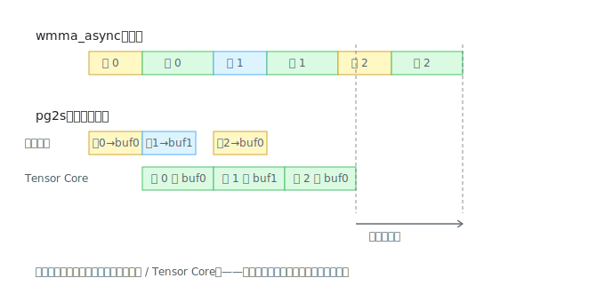

# wmma_async_pg2s 解读：双缓冲，把搬运藏进计算的影子里

> 对应源码：[src/wmma/wmma_async_pg2s.cu](../src/wmma/wmma_async_pg2s.cu)。前置阅读：[wmma_async 解读](wmma_async.md)。

全系列的高潮：Pg2s（Prefetch Global to Shared，双缓冲）把上一课买的入场券兑现成 **+32%**（实测 RTX 5060：23.3 → 30.7 TFLOPS，整条优化链最大的单步跳跃）。



## 核心机关：两块缓冲 + 异或翻转

smem 里 A+B 条带区开了**两份**（各 384 行），用 XOR 技巧轮流换角色（第 97-98、137-138 行）：

```cpp
size_t smem_store_off = 0;                // 写入口：拷贝引擎往这写
size_t smem_load_off  = smem_cache_off;   // 读出口：Tensor Core 从这读

for (...) {
    smem_store_off ^= smem_cache_off;     // 每轮开头：两个指针互换
    smem_load_off  ^= smem_cache_off;     // (0↔384，XOR 同一个数实现翻转)
    ...
}
```

写的人永远写一块，读的人永远读另一块，互不踩脚——这就是双缓冲（double buffering / ping-pong buffer）。

## 代码结构变了：序幕 → 流水线主体 → 尾声

前几课的 kernel 是均匀的循环，pg2s 变成了三段式——所有流水线代码的标准形状：

**序幕（第 100-133 行）**：把第 0 块条带搬进 buf0，`wait(0)` 等到货。流水线开工前先备好第一批料，这一步的搬运延迟藏不掉，认了。

**主体（第 136-209 行）**，每轮做三件事，注意顺序：

```cpp
1. 发射 cp.async：把第 k 块搬进 store 缓冲     （发完不等！）
2. 计算第 k-1 块（从 load 缓冲读）              ← 拷贝在后台飞行
3. commit + wait(0) + __syncthreads()          ← 算完了才结账
```

发射和结账之间隔着整段计算——拷贝引擎搬货的几百个周期，全部藏在 Tensor Core 干活的时间里。这就是上一课"发射与完成分离"的兑现时刻。

**尾声（第 211-241 行）**：循环结束时，最后一块条带刚到货还没算（流水线固有的"慢一拍"），补算它。注意第 218 行读的是 `smem_store_off`——最后一轮搬运写进的是 store 缓冲，这个细节最容易看晕。

## 两笔意外的白赚

**smem 账**：AB 条带 ×2 = 60KB，听起来翻倍很贵？但整个 kernel 的 smem 申请是 `max(AB区, C中转区) = max(60KB, 68KB) = 68KB`——和 padding 版一模一样。双缓冲的开销完全藏在 C 中转区的"阴影"里，occupancy 分文不损。

**同步账**：base/padding/async 每轮要 2 次 `__syncthreads()`（搬完等一次、算完等一次——防止下一轮的写覆盖还没读完的数据）。pg2s 每轮只要 **1 次**：写和读天然在不同缓冲，WAR 冒险消失，第二道栅栏直接省掉。

## 还剩什么没重叠

1. 每轮计算内部，smem→fragment 的 `load_matrix_sync` 和 `mma_sync` 还是先取后算——**ps2r** 用寄存器级双缓冲把这层也叠起来
2. 每轮结尾的 `wait(0)` 是硬停车：如果搬运偶尔比计算慢（大 K 或带宽抖动），Tensor Core 干等——**stage2/3** 用更深的缓冲池 + `wait_group(N>0)` 做出容错余量

## 检查点

1. XOR 翻转那两行，为什么用 `^=` 而不用 `if/else` 交换？效果上等价吗？
2. 主体循环里 `commit_group` 放在计算**之后**才执行，拷贝会不会因此推迟开始？
3. 尾声为什么从 `smem_store_off` 读而不是 `smem_load_off`？
4. 如果计算一块的时间 < 搬一块的时间（比如 K 很小、算术强度不足），pg2s 还能提速 32% 吗？瓶颈变成了谁？
