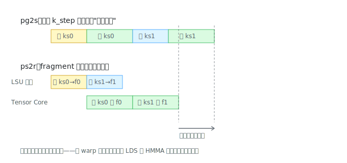

# wmma_async_pg2s_ps2r 解读：寄存器级双缓冲与流水线的分形

> 对应源码：[src/wmma/wmma_async_pg2s_ps2r.cu](../src/wmma/wmma_async_pg2s_ps2r.cu)。前置阅读：[wmma_async_pg2s 解读](wmma_async_pg2s.md)。

这一课的看点有两个：同一个"双缓冲"思想在更低一层的复刻，以及一个诚实的实测结果——**理论正确的优化不一定立刻兑现**。

## 它攻击的是哪条缝

pg2s 把 global→shared 的搬运藏进了计算，但每轮计算内部还有一条串行缝：

```
取瓦片(smem→寄存器) → 算(mma) → 取下一批 → 算 → ...
```

`load_matrix_sync` 从 smem 读数也要几十个周期，每个 k_step 里 Tensor Core 都得先等 8 次加载完成才能开算。ps2r（Prefetch Shared to Register）用一模一样的配方对付它——**fragment 也开两套，取和算错开一拍**：



## 代码模式：似曾相识的配方

fragment 数组多了一维（第 172-176 行）：

```cpp
wmma::fragment<...> A_frag[2][WARP_COL_TILES];   // pg2s 版只有 [WARP_COL_TILES]
wmma::fragment<...> B_frag[2][WARP_ROW_TILES];

size_t reg_store_idx = 0;   // 正在写入的那套
size_t reg_load_idx = 1;    // 正在被 mma 消费的那套
```

和 pg2s 的 `smem_store_off/load_off` 完全同构，翻转也是同款 XOR（`^= 1`）。每个 chunk 内部的节奏：

```
先取 k_step=0 → frag[0]                  // 寄存器级"序幕"
for k_step = 1..CHUNK_K-1:
    翻转两个 idx
    取 k_step → frag[store]              // 先发射下一批加载
    mma 用 frag[load]（上一批的数据）      // 加载在飞行时计算
最后补算 frag[store]                      // 寄存器级"尾声"
```

**序幕/主体/尾声的三段式在 chunk 内部又出现了一遍**——流水线是个分形结构：global→shared 一层、shared→register 一层，每层都是同一个模式。CUTLASS 把这个分形做到了四五层。

## 机制和 pg2s 有本质区别

pg2s 的重叠靠**独立硬件**——拷贝引擎后台搬、Tensor Core 前台算，`commit/wait_group` 是显式账本。ps2r 这层**没有任何显式同步原语**：`load_matrix_sync`（LDS 指令）发射后，后面的 `mma_sync`（HMMA 指令）用的是另一套寄存器，两者没有数据依赖——warp 调度器和硬件计分板自动发现这一点，把 LDS 的延迟藏进 HMMA 的执行时间。这叫**指令级并行**（ILP）：代码只负责解开依赖关系，重叠由硬件默默完成。

## 诚实的实测：理论 ≠ 立刻兑现

RTX 5060 实测（M=512 N=2048 K=1024，两次运行）：

```
Wmma-Async-Pg2s:       30.7 TFLOPS
Wmma-Async-Pg2s-Ps2r:  29.9 / 30.2 TFLOPS   ← 持平甚至略降
```

为什么没赚到？三个原因：

1. `CHUNK_K=2` 意味着每个 chunk 只有一次翻转机会，可重叠的窗口本来就窄
2. A/B fragment 翻倍让每线程寄存器压力又涨约 30 个，挤压调度弹性
3. SM 上本来就有多个 warp 轮转，**warp 级并行已经能掩盖一部分 LDS 延迟**——ps2r 的收益和它是重叠的，不是叠加的

这一课的元教训比技术本身更值钱：**每加一层流水线都有代价（寄存器/复杂度），收益取决于那条缝到底还剩多宽——profiler 永远是最终裁判**。在更大尺寸、不同架构上（作者的 RTX 3090 数据），这层优化有正收益。

## 检查点

1. ps2r 的重叠没有 `wait` 类指令，正确性靠什么保证？（提示：寄存器依赖、硬件计分板）
2. `A_frag[2][4] + B_frag[2][4]` 比单套多用多少个 32 位寄存器？（每个 fragment 16×16 个 half 摊给 32 线程）
3. 为什么 `CHUNK_K` 越大，ps2r 的理论收益越大？代价是什么？
4. "warp 级并行也能掩盖 LDS 延迟"——如果 SM 上只驻留 1 个 block（本 kernel 正是如此），warp 级并行还剩多少？
