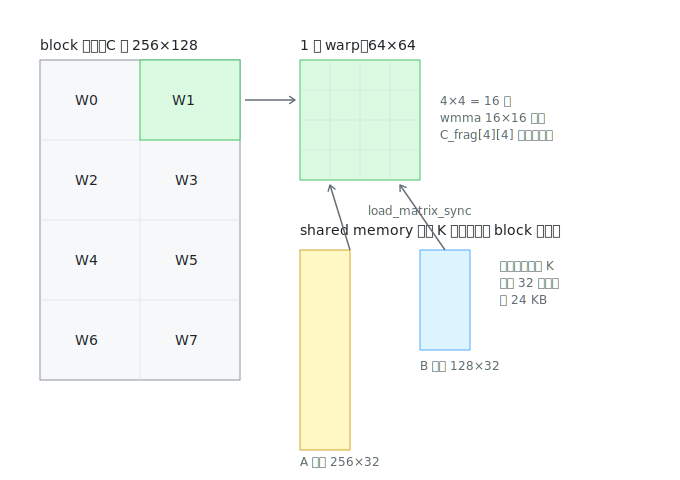

# wmma_base 逐段解读：数据复用与三级分块

> 对应源码：[src/wmma/wmma_base.cu](../src/wmma/wmma_base.cu)。前置阅读：[wmma_naive 逐行解读](wmma_naive.md)、[内存布局基础](memory_layout.md)。

wmma_base 是从"能用 Tensor Core"到"用好 Tensor Core"的关键一跳，核心思想就一个：**数据复用**。

## 药方：数据复用的账本

naive 的病根：C 同一行的每个 warp 都独立从 global memory 读同一条 A 条带，A 被重复读 N/16 次。wmma_base 的药方是**拼团**：

- 一个 block 管 C 的 **256×128** 大瓦片（8 个 warp 拼团）
- A 的条带先搬进 **shared memory**，block 内 8 个 warp 共享——A 的重复读取次数从 N/16 降到 **N/128**（8 倍削减），B 从 M/16 降到 **M/256**（16 倍削减）
- 每个 warp 的任务从 1 块 16×16 涨到 **64×64**（16 块 wmma 瓦片），`C_frag[4][4]` 常驻寄存器，摊薄调度开销



## 宏定义解码（第 13-43 行）

开头一堆宏就是三级分块的参数表，抓住三行：

```cpp
#define BLOCK_ROWS 256    // block 级：C 的 256×128
#define BLOCK_COLS 128
#define WARP_ROWS 64      // warp 级：4×2 排布的 8 个 warp，各管 64×64
#define WARP_COLS 64
#define CHUNK_K 2         // K 方向每轮外循环吃 2 块瓦片 = 32 个元素
```

其余宏全是这三者的派生（每次搬多少行、几个线程搬一行等），看不懂时代入数字算一遍即可。

## kernel 三阶段

### 阶段 1：协作搬运 global → shared（第 93-120 行）

要搬的货：A 条带 256 行 × 32 列 + B 条带 128 行 × 32 列。B 是列主序，它在 smem 里的"一行"其实是某个 N 列的 32 个 K 值——同一份拷贝代码对 A、B 通吃，这是选列主序的又一好处。搬法：

- 每个线程一次搬 `int4`（16 字节 = 8 个 half）——README 说的 **wide instruction** 就是它
- 一行 32 个 half = 64 字节 = 4 个 int4 → **4 个 lane 合搬一行**，一个 warp 一次搬 8 行
- A 有 256 行，8 个 warp 分——每个 warp 负责 32 行，循环 4 轮（`A_smem_iters = 4`）搬完；B 同理 2 轮

搬完 `__syncthreads()`：等所有 warp 把货上齐才能开算。

### 阶段 2：计算（第 123-152 行）

每个 warp 从 shared memory 加载自己那 4 块 A 瓦片、4 块 B 瓦片（注意 leading dimension 变成了 32——smem 里条带就这么宽），然后 4×4 = 16 次 `mma_sync`。第 147 行有个彩蛋：

```cpp
size_t j_s = (i % 2) ? (WARP_ROW_TILES - j - 1) : j;
```

遍历顺序不是逐行从左到右，而是**蛇形**：第 0 行左→右，第 1 行右→左……换行时 B_frag 不用换（上一行最后用的就是下一行第一个要用的），寄存器里的值接着用——README 里 "Register Reuse: Right Left Right Left" 说的就是这行代码。

### 阶段 3：写回也要绕道 shared memory（第 157-173 行）

naive 直接 `store_matrix_sync` 到 global memory，写的是 16×16 的小碎块，合并度差。base 先把 16 块 C_frag 全写进 shared memory（复用 AB 条带的空间，此时它们已没用），拼成完整连续的 256×128，再由每个 warp 用 int4 流式写出——每次写 256 字节连续内存，**完美合并**。宁可多一次 smem 往返，也要让 global memory 写入是大块连续的。

## 两个易忽略的细节

- **shared memory 用量 64KB**（C 中转需要 256×128×2B），超过默认的 48KB 静态上限，所以 `initWmmaBase()` 里要 `cudaFuncSetAttribute` 显式申请动态 shared memory——自己写大瓦片 kernel 忘了这步会直接 launch 失败
- **grid 蛇形映射**（第 53-55 行 + `BLOCK_STRIDE`）：block 在 C 上的行走顺序被刻意安排成 S 形蛇行，相邻发射的 block 尽量踩相邻的 A/B 条带，提高 **L2 缓存**命中率——README 的 "L2 Cache: swizzle access mode" 就在这
- 隐含约束：M、N、K 需分别被 256/128/32 整除，kernel 没做残块处理（benchmark 尺寸都满足）

## 它离 cuBLAS 还差什么

两个"串行等待"没解决：

1. 搬运和计算之间隔着 `__syncthreads()`，搬的时候算力闲着，算的时候搬运闲着——**async / pg2s / stage 系列**就是来重叠这两者的
2. smem 无 padding，`load_matrix_sync` 读条带时存在 **bank conflict**——**wmma_padding** 只改一个数组声明就能提速

## 检查点

1. 推导 `A_smem_iters = 4`：256 行、8 个 warp、每 warp 每轮 8 行，怎么算出来的？
2. 写回阶段为什么不直接 `store_matrix_sync` 到 global memory？
3. 蛇形 `j_s` 到底省了什么？如果去掉会错吗，还是只会慢？
4. 把 `BLOCK_ROWS` 改成 512 会发生什么？（提示：算算 shared memory）
