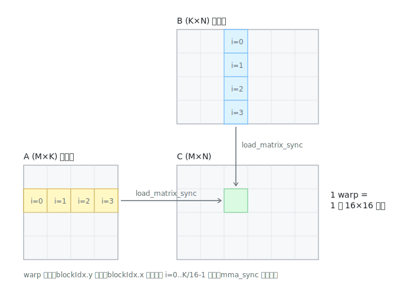

# wmma_naive 逐行解读：Tensor Core 入门

> 对应源码：[src/wmma/wmma_naive.cu](../src/wmma/wmma_naive.cu)（51 行，本仓库最简单的 Tensor Core 实现）

## 大图景：Tensor Core 到底做什么

普通 CUDA core 一条指令算一次 `a*b+c`（标量）；Tensor Core 一条指令算一整个**小矩阵乘法** `D = A×B + C`。WMMA API 下这个小矩阵的尺寸固定是 **16×16×16**（fp16）。

关键设定：**这个操作不属于单个线程，而属于一整个 warp**——32 个线程合力持有数据、合力发起计算，谁也不能单独行动。

`wmma_naive` 的策略是最朴素的：把输出矩阵 C 切成 16×16 的小瓦片，**每个 warp 负责算一块瓦片**，沿 K 方向一步步累加：



## 逐行拆解

### 第 1 步：启动配置（第 46-51 行）

```cpp
dim3 block(WARP_SIZE);                                  // 每个 block 恰好 32 线程 = 1 个 warp
dim3 grid(div_ceil(N, WMMA_N), div_ceil(M, WMMA_M));    // C 有多少块瓦片就开多少个 block
```

一个 block 就是一个 warp，这是刻意的极简设计。C 是 M×N，切成 16×16 瓦片后共有 `(M/16)×(N/16)` 块，grid 正好一一对应。

### 第 2 步：认领瓦片（第 21-22 行）

```cpp
const size_t warp_row = blockIdx.y * WMMA_M;   // 我负责的瓦片在 C 里的起始行
const size_t warp_col = blockIdx.x * WMMA_N;   // 起始列
```

### 第 3 步：准备累加器（第 28-30 行）

```cpp
wmma::fragment<wmma::accumulator, 16, 16, 16, half> C_frag;
wmma::fill_fragment(C_frag, 0.0);
```

`fragment` 是整个 WMMA 最特别的概念：它是一块**分布在 32 个线程寄存器里**的数据。一个 16×16 的瓦片有 256 个元素，摊到 32 个线程，每人在自己的寄存器里扛 8 个——但**哪个线程扛哪几个元素是编译器决定的黑盒**，你不能也不需要知道。所以 fragment 不能用下标随便访问，只能整体地填充（`fill_fragment`）、加载（`load_matrix_sync`）、计算（`mma_sync`）、写回（`store_matrix_sync`）。

### 第 4 步：沿 K 方向循环累加（第 33-41 行，核心）

```cpp
for (size_t i = 0; i < K_tiles; ++i) {
    wmma::load_matrix_sync(A_frag, A + warp_row * K + i * WMMA_K, K);
    wmma::load_matrix_sync(B_frag, B + i * WMMA_K + warp_col * K, K);
    wmma::mma_sync(C_frag, A_frag, B_frag, C_frag);   // C_frag += A_frag × B_frag
}
```

对照示意图：绿色 C 瓦片 = 黄色 A 行条带里的第 i 块 × 蓝色 B 列条带里的第 i 块，逐块累加。三个细节：

- `A + warp_row * K + i * WMMA_K` 是指针算术：跳到第 `warp_row` 行（每行 K 个元素），再向右偏移 `i*16` 列——正好指向条带里第 i 块瓦片的左上角。
- 第三个参数 `K` 叫 **leading dimension**：瓦片在大矩阵里不是连续存储的，每行 16 个元素之间隔着一整行（K 个元素），这个参数告诉硬件"跳多远找下一行"。
- B 用 `col_major`（列主序，一列 K 个元素连续存），所以它的偏移是 `warp_col * K`（跳到第 warp_col 列）`+ i * WMMA_K`（列内向下走）。

所有函数带 `_sync` 后缀 = **32 个线程必须同时执行到这里**，谁也不能分叉走 if/else 绕开，否则行为未定义。

### 第 5 步：写回（第 43 行）

```cpp
wmma::store_matrix_sync(C + warp_row * N + warp_col, C_frag, N, wmma::mem_row_major);
```

把寄存器里的累加结果整体写回 C，leading dimension 换成了 N（C 每行 N 个元素）。

## 为什么它慢

看图想一个问题：C 同一行的每块瓦片（各由不同的 warp 负责），都要读**同一条黄色 A 条带**。naive 版本里每个 warp 都直接从 global memory 读——同样的数据被重复读了 N/16 次，B 同理被重复读 M/16 次。矩阵越大浪费越狠，这就是它远低于 cuBLAS 性能的原因。

`wmma_base` 的解法：一个 block 里放多个 warp，先把条带搬进 shared memory 共享着用——这是数据复用（data reuse）优化的起点，也是后续 padding / async / stage 系列优化的地基。

## 检查点

不看代码回答：

1. fragment 里的数据物理上存在哪里？为什么不能 `A_frag[3]` 这样访问？
2. `load_matrix_sync` 第三个参数（leading dimension）传错会发生什么？
3. 如果 M=512、N=2048，这个 kernel 会启动多少个 warp？
