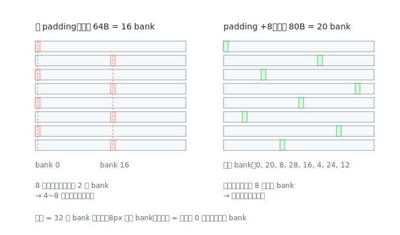

# wmma_padding 解读：用 8 个 half 消灭 bank conflict

> 对应源码：[src/wmma/wmma_padding.cu](../src/wmma/wmma_padding.cu)。前置阅读：[wmma_base 逐段解读](wmma_base.md)。

整个优化链里"改动最小、性能白捡"的一课。和 base 的完整差异只有三个数字：

```cpp
#define SMEM_PADDING 8
#define AB_SMEM_STRIDE 40    // base: 32   (+8)
#define C_SMEM_STRIDE 136    // base: 128  (+8)
```

外加 `load_matrix_sync` 的 leading dimension 跟着从 32 变 40。逻辑零改动——每行故意多占 8 个 half 的空位，谁也不写它。整课要回答的就是一个问题：**为什么白白浪费这点空间能换来性能？**

## Bank 是什么

Shared memory 在硬件上被切成 **32 个 bank**，每个 bank 每周期只能服务一次 4 字节访问。地址到 bank 的映射是轮转的：

```
bank = (字节地址 / 4) % 32
```

连续的 128 字节正好铺满 32 个 bank 一圈。warp 的 32 个线程同时发访存时：

- 落在**不同 bank** → 并行服务，1 个周期完事
- N 个线程落在**同一个 bank 的不同地址** → 排队串行，耗 N 个周期——**N-way bank conflict**，shared memory 瞬间慢 N 倍
- 例外：多个线程读**同一个地址**会触发广播（broadcast），不算冲突

## base 版本的病：行距是 2 的幂

base 的 smem 每行 32 个 half = 64 字节 = **16 个 bank**。第 r 行的起始 bank：

```
(r × 16) % 32 = 0, 16, 0, 16, 0, 16, ...   ← 只有 2 种对齐
```

而 `load_matrix_sync` 读一块 16×16 瓦片要竖着跨 16 行取数——同一列的元素隔行就撞进同一个 bank，16 行挤在 2 种对齐里，冲突高达 8-way。



## 为什么偏偏加 8 个 half

padding 的数值不是拍脑袋，受两个约束夹逼：

**约束 1：不能破坏 int4 对齐（下限）**。拷贝代码用 `int4` 一次写 16 字节，要求每行起始地址是 16 的倍数，即行距必须是 8 个 half（16B）的倍数：可选 padding 只有 8、16、24……**8 是最小步**。加 4 的话行距 72B，int4 访问直接非法。

**约束 2：把 2 的幂的"共振"打破得越彻底越好**。行距换算成 bank 数后，不同行的起始对齐种数由此决定：

```
对齐种数 = 32 / gcd(行距bank数, 32)
```

| padding | 行距 | bank 数 | gcd | 对齐种数 |
|---|---|---|---|---|
| 0（base） | 64B | 16 | 16 | **2 种** ← 挤成一团 |
| **+8** | 80B | 20 | 4 | **8 种** ← 散开 |
| +16 | 96B | 24 | 8 | 4 种（更差） |

所以 8 是"最小且效果最好"的选择。C 中转区同理：128→136。

## 代价：几乎白送

- AB 条带：24KB → 30KB（每行浪费 16B × 384 行）
- C 中转：64KB → **68KB**（benchmark 日志里的 `smem_max_size: 68 KBytes` 就是这么来的）
- 仍在 SM 的共享内存限额内，occupancy 不变——纯赚

## 遗留问题：浪费能不能不付？

padding 是"用空间换对齐"，30KB 里有 6KB 是纯空位。**mma_permuted**（MMA PTX 路线）给出了更优雅的答案：不加一个字节的 padding，而是把数据在 smem 里的摆放位置做异或重排，让冲突从数学上消失——代价是取数地址的计算变绕。那是本仓库最烧脑的技巧。

## 检查点

1. warp 里 32 个线程都读 `smem[tid][0]`（同一列不同行，行距 64B），是几路冲突？行距 80B 呢？
2. 为什么 padding 必须是 8 个 half 的倍数？哪行代码定下了这个约束？
3. 所有线程读**同一个地址**（比如都读 `smem[0][0]`）会冲突吗？
4. 如果把 `AB_SMEM_STRIDE` 改成 48（padding+16），预期性能比 40 好还是差？为什么？
